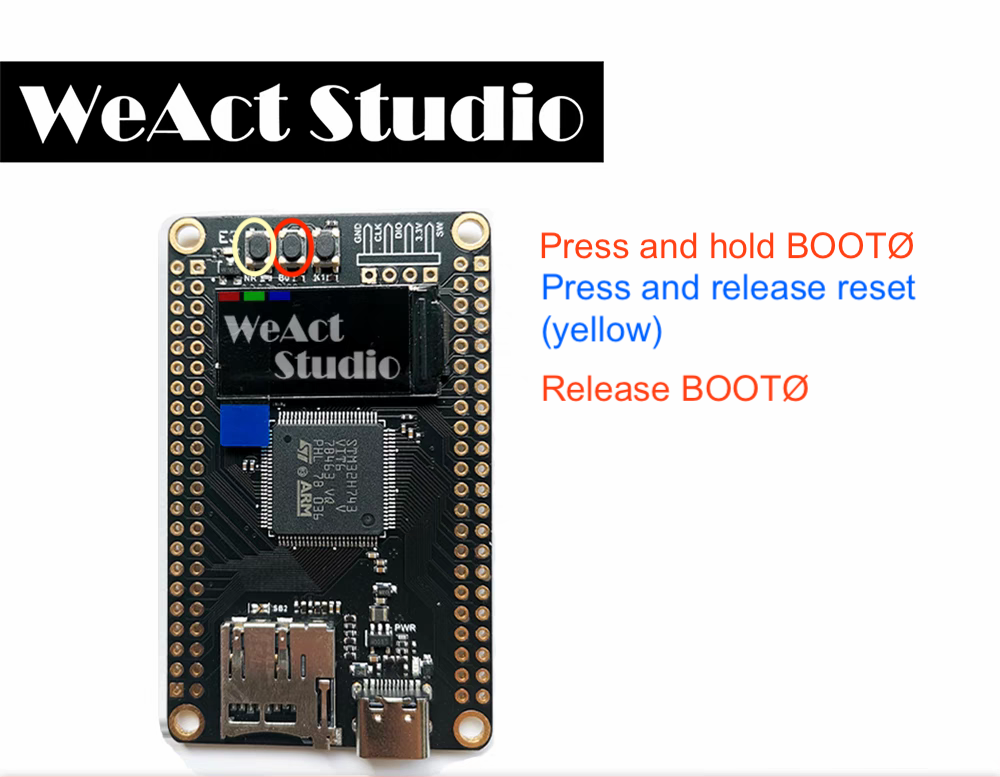
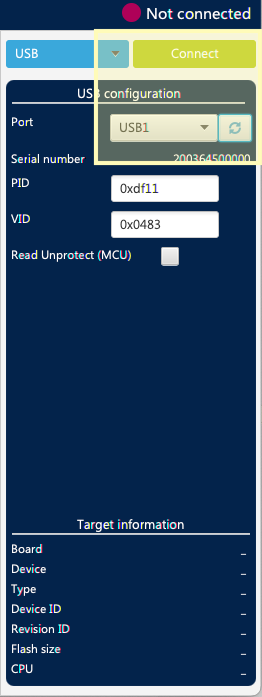
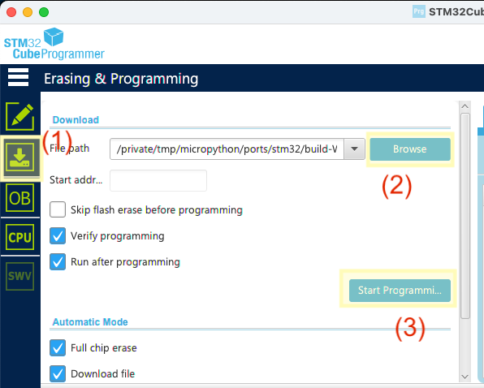
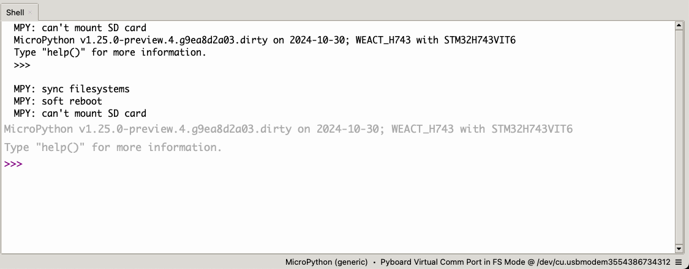
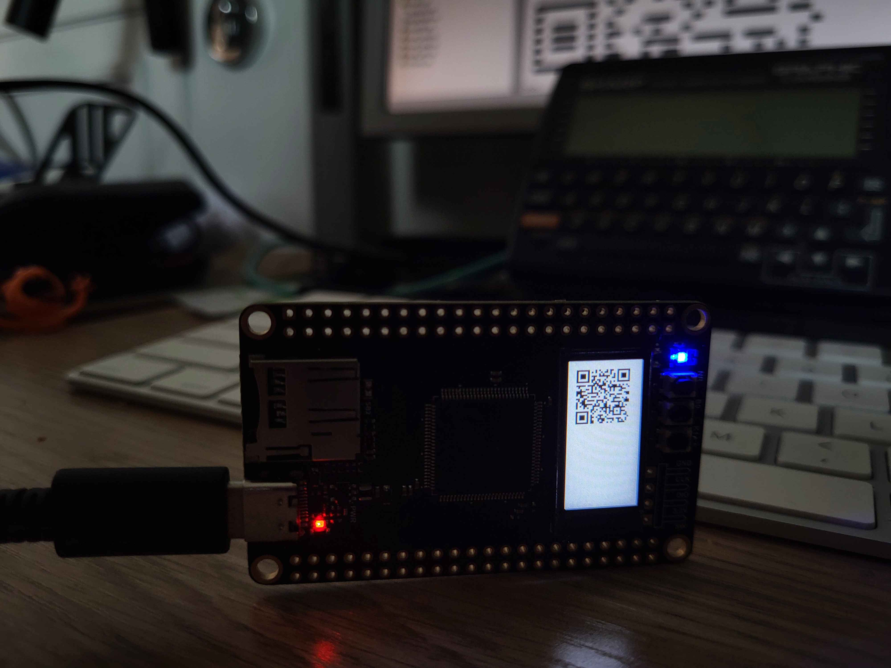

# How to compile MP for the WeAct Studio STM32H743

Bonus track: Native QR Code creation.

See their [github page](https://github.com/WeActStudio/MiniSTM32H7xx).
[AliExpress Listing](https://www.aliexpress.com/item/1005006632336183.html).


## Create the firmware

```bash
git clone https://github.com/micropython/micropython
open micropython/ports/stm32/
```

<copy files/folders>

* --> Makefile: replace file
* --> wdt.c, kongduino.c & kongduino/ Copy into ports/stm32
* --> WEACT_H743/ Copy into ports/stm32/boards

```bash
cd micropython
make -j 12 -C mpy-cross
cd ports/stm32/
make -j 12 BOARD=WEACT_H743 submodules
make -j 12 BOARD=WEACT_H743
```

`firmware.hex` is in `ports/stm32/build-WEACT_H743`.

## Upload

1. Put the device in DFU mode.



2. Open [STM32CubeProgrammer](Assets/https://www.st.com/en/development-tools/stm32cubeprog.html)

3. Select USB1 and click Connect



4. Click Erasing and Programming.
5. Click Browse and select firmware.hex
6. Click Start Programming.



Et voilà !



